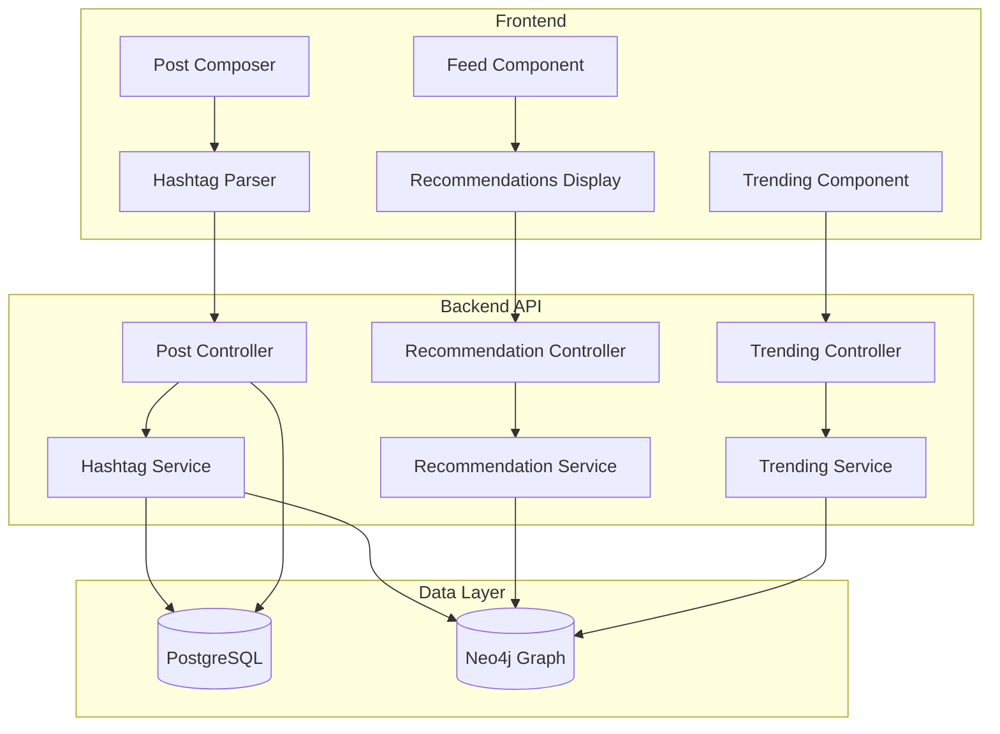

# Design Document - Sistema de Hashtags e Recomendações

## Overview

Este documento descreve o design técnico para implementar um sistema de hashtags e recomendações inteligentes no EsporTz, similar ao Twitter. O sistema utilizará Neo4j para criar um grafo de relacionamentos entre usuários, posts, hashtags e likes, permitindo recomendações baseadas em múltiplos fatores de similaridade.

### Objetivos Principais

1. Extrair e armazenar hashtags automaticamente dos posts
2. Criar relacionamentos no grafo Neo4j para análise de similaridade
3. Implementar algoritmos de recomendação de posts baseados em hashtags, likes e conexões sociais
4. Implementar algoritmos de recomendação de usuários baseados em interesses compartilhados
5. Exibir trending hashtags em tempo real
6. Manter performance e escalabilidade

## Architecture

### High-Level Architecture



### Data Flow

1. **Post Creation Flow**
   - Usuário escreve post com hashtags
   - Frontend extrai hashtags do texto
   - Backend salva post no PostgreSQL
   - Backend extrai/valida hashtags
   - Backend cria nós e relacionamentos no Neo4j

2. **Recommendation Flow**
   - Usuário solicita recomendações
   - Backend consulta Neo4j com algoritmo de grafo
   - Neo4j retorna posts/usuários ranqueados por score
   - Backend enriquece dados do PostgreSQL
   - Frontend exibe recomendações

3. **Trending Flow**
   - Sistema calcula trending hashtags periodicamente
   - Consulta Neo4j para contar posts por hashtag em janela de tempo
   - Cache de resultados por 15 minutos
   - Frontend exibe trending hashtags

## Components and Interfaces

### 1. Database Schema

#### PostgreSQL - Nova Entidade Hashtag

```typescript
@Entity()
export class Hashtag extends BaseEntity {
    @Column({ type: "string", unique: true })
    tag!: string; // sem o #, lowercase
    
    @Column({ type: "string" })
    displayTag!: string; // com capitalização original
    
    @Column({ type: "int", default: 0 })
    postCount!: number; // cache de contagem
    
    @Column({ type: "timestamp", default: () => "CURRENT_TIMESTAMP" })
    lastUsedAt!: Date;
    
    @ManyToMany("Post", "hashtags")
    posts!: Post[];
}
```

#### PostgreSQL - Atualização da Entidade Post

```typescript
@Entity()
export class Post extends BaseEntity {
    // ... campos existentes ...
    
    @ManyToMany("Hashtag", "posts")
    @JoinTable({
        name: "post_hashtags",
        joinColumn: { name: "postId", referencedColumnName: "id" },
        inverseJoinColumn: { name: "hashtagId", referencedColumnName: "id" }
    })
    hashtags!: Hashtag[];
}
```

#### Neo4j - Graph Schema

```cypher
// Nós
(:User {id: UUID, username: String})
(:Post {id: UUID, createdAt: DateTime})
(:Hashtag {tag: String, displayTag: String})

// Relacionamentos existentes
(:User)-[:POSTED]->(:Post)
(:User)-[:LIKED]->(:Post)
(:User)-[:FOLLOWS]->(:User)
(:Post)-[:REPLY_TO]->(:Post)

// Novos relacionamentos
(:Post)-[:HAS_TAG]->(:Hashtag)
(:User)-[:USED_TAG {count: Int, lastUsedAt: DateTime}]->(:Hashtag)
(:User)-[:INTERESTED_IN {score: Float}]->(:Hashtag)

// Relacionamento derivado (calculado periodicamente)
(:User)-[:SIMILAR_TO {score: Float, reason: String}]->(:User)
```

### 2. Backend Services

#### HashtagService

```typescript
interface HashtagService {
    // Extrai hashtags de um texto
    extractHashtags(content: string): string[];
    
    // Cria ou atualiza hashtags no PostgreSQL
    upsertHashtags(tags: string[]): Promise<Hashtag[]>;
    
    // Sincroniza hashtags no Neo4j
    syncHashtagsToNeo4j(postId: string, hashtags: Hashtag[], userId: string): Promise<void>;
    
    // Busca posts por hashtag
    getPostsByHashtag(tag: string, limit: number, offset: number): Promise<Post[]>;
    
    // Busca hashtags por padrão
    searchHashtags(query: string, limit: number): Promise<Hashtag[]>;
}
```

#### RecommendationService

```typescript
interface PostRecommendation {
    post: Post;
    score: number;
    reasons: string[]; // ex: ["shared_hashtag:fitness", "liked_by_following"]
}

interface UserRecommendation {
    user: User;
    score: number;
    reasons: string[]; // ex: ["similar_hashtags", "friend_of_friend"]
}

interface RecommendationService {
    // Recomenda posts para um usuário
    recommendPosts(userId: string, limit: number): Promise<PostRecommendation[]>;
    
    // Recomenda usuários para seguir
    recommendUsers(userId: string, limit: number): Promise<UserRecommendation[]>;
    
    // Calcula similaridade entre usuários (background job)
    calculateUserSimilarity(userId: string): Promise<void>;
}
```

#### TrendingService

```typescript
interface TrendingHashtag {
    tag: string;
    displayTag: string;
    postCount: number;
    userCount: number;
    growthRate: number; // percentual de crescimento
    isTrending: boolean;
}

interface TrendingService {
    // Retorna hashtags em alta
    getTrendingHashtags(timeWindow: '1h' | '24h' | '7d', limit: number): Promise<TrendingHashtag[]>;
    
    // Atualiza cache de trending (chamado periodicamente)
    updateTrendingCache(): Promise<void>;
}
```

### 3. Neo4j Queries

#### Query 1: Recomendação de Posts

```cypher
// Recomenda posts baseado em múltiplos fatores
MATCH (me:User {id: $userId})

// Fator 1: Posts com hashtags que eu uso frequentemente
OPTIONAL MATCH (me)-[ut:USED_TAG]->(tag:Hashtag)<-[:HAS_TAG]-(post1:Post)
WHERE NOT (me)-[:POSTED]->(post1)
  AND NOT (me)-[:LIKED]->(post1)
  AND post1.createdAt > datetime() - duration('P7D')
WITH me, post1, sum(ut.count) as hashtagScore

// Fator 2: Posts curtidos por pessoas que eu sigo
OPTIONAL MATCH (me)-[:FOLLOWS]->(friend:User)-[:LIKED]->(post2:Post)
WHERE NOT (me)-[:POSTED]->(post2)
  AND NOT (me)-[:LIKED]->(post2)
  AND post2.createdAt > datetime() - duration('P7D')
WITH me, post1, hashtagScore, post2, count(friend) as friendLikeScore

// Fator 3: Posts de usuários similares
OPTIONAL MATCH (me)-[sim:SIMILAR_TO]->(similar:User)-[:POSTED]->(post3:Post)
WHERE NOT (me)-[:LIKED]->(post3)
  AND post3.createdAt > datetime() - duration('P7D')
WITH post1, hashtagScore, post2, friendLikeScore, post3, sim.score as similarityScore

// Combina todos os posts e calcula score final
WITH collect({post: post1, score: hashtagScore * 2.0}) + 
     collect({post: post2, score: friendLikeScore * 1.5}) +
     collect({post: post3, score: similarityScore * 1.0}) as allPosts

UNWIND allPosts as postData
WITH postData.post as post, sum(postData.score) as finalScore
WHERE post IS NOT NULL

RETURN DISTINCT post.id as postId, finalScore
ORDER BY finalScore DESC, post.createdAt DESC
LIMIT $limit
```

#### Query 2: Recomendação de Usuários

```cypher
// Recomenda usuários baseado em interesses compartilhados
MATCH (me:User {id: $userId})

// Fator 1: Usuários que usam hashtags similares
OPTIONAL MATCH (me)-[myTag:USED_TAG]->(tag:Hashtag)<-[theirTag:USED_TAG]-(user1:User)
WHERE user1.id <> $userId
  AND NOT (me)-[:FOLLOWS]->(user1)
WITH me, user1, sum(myTag.count * theirTag.count) as hashtagSimilarity

// Fator 2: Usuários que curtiram posts similares
OPTIONAL MATCH (me)-[:LIKED]->(post:Post)<-[:LIKED]-(user2:User)
WHERE user2.id <> $userId
  AND NOT (me)-[:FOLLOWS]->(user2)
WITH me, user1, hashtagSimilarity, user2, count(post) as sharedLikes

// Fator 3: Amigos de amigos
OPTIONAL MATCH (me)-[:FOLLOWS]->(friend:User)-[:FOLLOWS]->(user3:User)
WHERE user3.id <> $userId
  AND NOT (me)-[:FOLLOWS]->(user3)
WITH user1, hashtagSimilarity, user2, sharedLikes, user3, count(friend) as mutualFriends

// Combina scores
WITH collect({user: user1, score: hashtagSimilarity * 3.0}) +
     collect({user: user2, score: sharedLikes * 2.0}) +
     collect({user: user3, score: mutualFriends * 1.5}) as allUsers

UNWIND allUsers as userData
WITH userData.user as user, sum(userData.score) as finalScore
WHERE user IS NOT NULL

RETURN DISTINCT user.id as userId, finalScore
ORDER BY finalScore DESC
LIMIT $limit
```

#### Query 3: Trending Hashtags

```cypher
// Calcula hashtags em alta nas últimas 24h
MATCH (tag:Hashtag)<-[:HAS_TAG]-(post:Post)
WHERE post.createdAt > datetime() - duration('P1D')

WITH tag, count(DISTINCT post) as postCount24h, 
     count(DISTINCT post.authorId) as userCount24h

// Compara com período anterior para calcular crescimento
OPTIONAL MATCH (tag)<-[:HAS_TAG]-(oldPost:Post)
WHERE oldPost.createdAt > datetime() - duration('P2D')
  AND oldPost.createdAt <= datetime() - duration('P1D')

WITH tag, postCount24h, userCount24h, count(DISTINCT oldPost) as postCountPrevious

WITH tag, postCount24h, userCount24h,
     CASE 
       WHEN postCountPrevious > 0 
       THEN toFloat(postCount24h - postCountPrevious) / postCountPrevious * 100
       ELSE 100.0
     END as growthRate

RETURN tag.tag as tag, 
       tag.displayTag as displayTag,
       postCount24h as postCount,
       userCount24h as userCount,
       growthRate,
       growthRate > 50.0 as isTrending
ORDER BY postCount24h DESC, growthRate DESC
LIMIT $limit
```

#### Query 4: Calcular Similaridade entre Usuários (Background Job)

```cypher
// Calcula e armazena similaridade entre usuários
MATCH (user:User {id: $userId})

// Encontra usuários com interesses similares
MATCH (user)-[myTag:USED_TAG]->(tag:Hashtag)<-[theirTag:USED_TAG]-(other:User)
WHERE other.id <> $userId

WITH user, other, 
     sum(myTag.count * theirTag.count) as hashtagScore,
     collect(tag.tag) as sharedTags

// Adiciona score de likes compartilhados
OPTIONAL MATCH (user)-[:LIKED]->(post:Post)<-[:LIKED]-(other)
WITH user, other, hashtagScore, sharedTags, count(post) as sharedLikes

// Calcula score final normalizado
WITH user, other, sharedTags,
     (hashtagScore * 0.6 + sharedLikes * 0.4) as rawScore

// Normaliza score para 0-1
WITH user, other, sharedTags, rawScore,
     rawScore / (1.0 + rawScore) as normalizedScore

WHERE normalizedScore > 0.1

// Cria ou atualiza relacionamento SIMILAR_TO
MERGE (user)-[sim:SIMILAR_TO]->(other)
SET sim.score = normalizedScore,
    sim.reason = substring(reduce(s = '', tag IN sharedTags[0..3] | s + tag + ','), 0, 100),
    sim.updatedAt = datetime()

RETURN count(sim) as similaritiesCreated
```

### 4. API Endpoints

#### Hashtag Endpoints

```typescript
// GET /api/hashtags/search?q=fitness&limit=10
// Busca hashtags por padrão
router.get('/hashtags/search', hashtagController.searchHashtags);

// GET /api/hashtags/:tag/posts?limit=20&offset=0
// Lista posts de uma hashtag
router.get('/hashtags/:tag/posts', hashtagController.getPostsByHashtag);

// GET /api/hashtags/trending?window=24h&limit=10
// Retorna hashtags em alta
router.get('/hashtags/trending', hashtagController.getTrendingHashtags);
```

#### Recommendation Endpoints

```typescript
// GET /api/recommendations/posts?limit=10
// Recomenda posts para o usuário autenticado
router.get('/recommendations/posts', authMiddleware, recommendationController.recommendPosts);

// GET /api/recommendations/users?limit=5
// Recomenda usuários para seguir
router.get('/recommendations/users', authMiddleware, recommendationController.recommendUsers);

// POST /api/recommendations/refresh
// Força recálculo de similaridades (admin/background job)
router.post('/recommendations/refresh', authMiddleware, recommendationController.refreshSimilarities);
```

#### Updated Post Endpoints

```typescript
// POST /api/posts
// Criar post (agora com extração de hashtags)
// Body: { content: string, parentId?: string, workoutActivityIds?: string[] }
router.post('/posts', authMiddleware, postController.createPost);

// GET /api/posts/feed
// Feed com posts recomendados misturados
router.get('/posts/feed', authMiddleware, postController.getFeed);
```

### 5. Frontend Components

#### HashtagLink Component

```typescript
@Component({
  selector: 'app-hashtag-link',
  template: `
    <a [routerLink]="['/hashtags', tag]" 
       class="hashtag-link"
       (click)="onHashtagClick($event)">
      #{{tag}}
    </a>
  `
})
export class HashtagLinkComponent {
  @Input() tag!: string;
  
  onHashtagClick(event: Event): void {
    // Track analytics
  }
}
```

#### HashtagParser Pipe

```typescript
@Pipe({ name: 'parseHashtags' })
export class HashtagParserPipe implements PipeTransform {
  transform(content: string): SafeHtml {
    // Regex para encontrar hashtags
    const hashtagRegex = /#(\w+)/g;
    
    // Substitui hashtags por links
    const parsed = content.replace(
      hashtagRegex,
      '<a href="/hashtags/$1" class="hashtag-link">#$1</a>'
    );
    
    return this.sanitizer.bypassSecurityTrustHtml(parsed);
  }
}
```

#### RecommendedPosts Component

```typescript
@Component({
  selector: 'app-recommended-posts',
  template: `
    <div class="recommended-section">
      <h3>Recomendado para você</h3>
      <div *ngFor="let recommendation of recommendations">
        <app-post-card [post]="recommendation.post"></app-post-card>
        <div class="recommendation-reasons">
          <span *ngFor="let reason of recommendation.reasons" class="reason-badge">
            {{formatReason(reason)}}
          </span>
        </div>
      </div>
    </div>
  `
})
export class RecommendedPostsComponent implements OnInit {
  recommendations: PostRecommendation[] = [];
  
  ngOnInit(): void {
    this.loadRecommendations();
  }
  
  loadRecommendations(): void {
    this.recommendationService.getRecommendedPosts(10).subscribe(
      recommendations => this.recommendations = recommendations
    );
  }
  
  formatReason(reason: string): string {
    // Formata razões para exibição amigável
    const reasonMap: Record<string, string> = {
      'shared_hashtag': 'Hashtag em comum',
      'liked_by_following': 'Curtido por quem você segue',
      'similar_user': 'De usuário similar'
    };
    return reasonMap[reason.split(':')[0]] || reason;
  }
}
```

#### TrendingHashtags Component

```typescript
@Component({
  selector: 'app-trending-hashtags',
  template: `
    <div class="trending-section">
      <h3>Trending</h3>
      <div *ngFor="let trending of trendingHashtags; let i = index" 
           class="trending-item">
        <span class="rank">{{i + 1}}</span>
        <a [routerLink]="['/hashtags', trending.tag]" class="trending-tag">
          #{{trending.displayTag}}
          <mat-icon *ngIf="trending.isTrending" class="trending-icon">
            trending_up
          </mat-icon>
        </a>
        <span class="post-count">{{trending.postCount}} posts</span>
      </div>
    </div>
  `
})
export class TrendingHashtagsComponent implements OnInit {
  trendingHashtags: TrendingHashtag[] = [];
  
  ngOnInit(): void {
    this.loadTrending();
    
    // Atualiza a cada 5 minutos
    interval(5 * 60 * 1000).subscribe(() => this.loadTrending());
  }
  
  loadTrending(): void {
    this.hashtagService.getTrendingHashtags('24h', 10).subscribe(
      trending => this.trendingHashtags = trending
    );
  }
}
```

## Data Models

### TypeScript Interfaces

```typescript
// Hashtag model
export interface Hashtag {
  id: string;
  tag: string; // lowercase, sem #
  displayTag: string; // capitalização original
  postCount: number;
  lastUsedAt: Date;
  createdAt: Date;
  updatedAt: Date;
}

// Post recommendation
export interface PostRecommendation {
  post: Post;
  score: number;
  reasons: RecommendationReason[];
}

export interface RecommendationReason {
  type: 'shared_hashtag' | 'liked_by_following' | 'similar_user' | 'popular';
  value?: string; // ex: nome da hashtag
  weight: number;
}

// User recommendation
export interface UserRecommendation {
  user: User;
  score: number;
  reasons: UserRecommendationReason[];
  mutualFollowers?: User[];
  sharedHashtags?: string[];
}

export interface UserRecommendationReason {
  type: 'similar_hashtags' | 'friend_of_friend' | 'shared_likes' | 'popular';
  value?: string;
  weight: number;
}

// Trending hashtag
export interface TrendingHashtag {
  tag: string;
  displayTag: string;
  postCount: number;
  userCount: number;
  growthRate: number;
  isTrending: boolean;
}
```

## Error Handling

### Error Scenarios

1. **Neo4j Indisponível**
   - Fallback: Retornar posts/usuários aleatórios ou populares
   - Log: Registrar erro para monitoramento
   - User Experience: Sistema continua funcionando sem recomendações personalizadas

2. **Hashtag Inválida**
   - Validação: Apenas caracteres alfanuméricos e underscore
   - Limite: Máximo 50 caracteres
   - Resposta: 400 Bad Request com mensagem clara

3. **Timeout em Queries Complexas**
   - Timeout: 500ms para queries de recomendação
   - Fallback: Retornar resultados parciais ou cache
   - Otimização: Índices no Neo4j

4. **Sincronização PostgreSQL-Neo4j Falha**
   - Estratégia: Operação assíncrona, não bloqueia usuário
   - Retry: Tentar novamente em background
   - Consistência eventual: Aceitar pequena defasagem

### Error Response Format

```typescript
interface ErrorResponse {
  error: {
    code: string;
    message: string;
    details?: any;
  };
  fallback?: {
    used: boolean;
    type: 'random' | 'popular' | 'cached';
  };
}
```

## Testing Strategy

### Unit Tests

1. **HashtagService**
   - Extração de hashtags de texto
   - Validação de hashtags
   - Upsert de hashtags no banco

2. **RecommendationService**
   - Cálculo de scores
   - Ordenação de resultados
   - Fallback quando Neo4j indisponível

3. **TrendingService**
   - Cálculo de crescimento
   - Cache de resultados
   - Atualização periódica

### Integration Tests

1. **Post Creation Flow**
   - Criar post com hashtags
   - Verificar sincronização PostgreSQL
   - Verificar sincronização Neo4j
   - Verificar relacionamentos criados

2. **Recommendation Flow**
   - Criar cenário com usuários e posts
   - Verificar recomendações retornadas
   - Validar scores e ordenação

3. **Trending Flow**
   - Criar posts com hashtags
   - Verificar cálculo de trending
   - Validar cache

### E2E Tests

1. **User Journey: Descobrir Conteúdo**
   - Usuário cria post com hashtag
   - Usuário clica em hashtag
   - Usuário vê posts relacionados
   - Usuário recebe recomendações

2. **User Journey: Encontrar Pessoas**
   - Usuário interage com posts
   - Usuário recebe sugestões de pessoas
   - Usuário segue pessoa sugerida
   - Recomendações melhoram

## Performance Considerations

### Indexing Strategy

#### PostgreSQL Indexes

```sql
-- Índice para busca de hashtags
CREATE INDEX idx_hashtag_tag ON hashtag(tag);

-- Índice para posts por hashtag (join table)
CREATE INDEX idx_post_hashtags_hashtag ON post_hashtags(hashtagId);
CREATE INDEX idx_post_hashtags_post ON post_hashtags(postId);

-- Índice para ordenação por data
CREATE INDEX idx_post_created_at ON post(createdAt DESC);
```

#### Neo4j Indexes

```cypher
// Índices para nós
CREATE INDEX user_id FOR (u:User) ON (u.id);
CREATE INDEX post_id FOR (p:Post) ON (p.id);
CREATE INDEX hashtag_tag FOR (h:Hashtag) ON (h.tag);

// Índices compostos para queries comuns
CREATE INDEX post_created FOR (p:Post) ON (p.createdAt);

// Constraints de unicidade
CREATE CONSTRAINT user_id_unique FOR (u:User) REQUIRE u.id IS UNIQUE;
CREATE CONSTRAINT post_id_unique FOR (p:Post) REQUIRE p.id IS UNIQUE;
CREATE CONSTRAINT hashtag_tag_unique FOR (h:Hashtag) REQUIRE h.tag IS UNIQUE;
```

### Caching Strategy

1. **Trending Hashtags**
   - Cache: Redis ou in-memory
   - TTL: 15 minutos
   - Invalidação: Atualização periódica em background

2. **User Similarities**
   - Armazenamento: Neo4j (relacionamento SIMILAR_TO)
   - Atualização: Background job a cada 6 horas
   - Incremental: Apenas usuários ativos recentemente

3. **Recommendation Results**
   - Cache: Redis com TTL de 5 minutos
   - Key: `recommendations:posts:${userId}`
   - Invalidação: Quando usuário interage (like, follow)

### Query Optimization

1. **Limit Result Sets**
   - Sempre usar LIMIT nas queries Neo4j
   - Paginação para listas longas
   - Timeout de 500ms

2. **Batch Operations**
   - Sincronizar hashtags em batch
   - Calcular similaridades em lotes
   - Usar UNWIND para operações múltiplas

3. **Avoid N+1 Queries**
   - Usar eager loading no TypeORM
   - Combinar queries Neo4j quando possível
   - Usar DataLoader pattern se necessário

## Security Considerations

1. **Input Validation**
   - Sanitizar hashtags (remover caracteres especiais)
   - Limitar tamanho de hashtags (max 50 chars)
   - Prevenir injection em queries Cypher

2. **Rate Limiting**
   - Limitar criação de posts (ex: 10 por minuto)
   - Limitar requisições de recomendações
   - Throttle de trending hashtags

3. **Authorization**
   - Verificar autenticação em todos os endpoints
   - Validar ownership de posts
   - Proteger endpoints de admin (refresh similarities)

4. **Data Privacy**
   - Não expor dados sensíveis em recomendações
   - Respeitar configurações de privacidade do usuário
   - Anonimizar dados em analytics

## Migration Strategy

### Phase 1: Database Setup
1. Criar entidade Hashtag no PostgreSQL
2. Adicionar relacionamento Post-Hashtag
3. Criar índices necessários
4. Executar migrations

### Phase 2: Neo4j Schema
1. Criar constraints e índices no Neo4j
2. Migrar dados existentes (usuários, posts, likes)
3. Validar integridade dos dados

### Phase 3: Backend Implementation
1. Implementar HashtagService
2. Atualizar createPost para extrair hashtags
3. Implementar sincronização Neo4j
4. Implementar RecommendationService
5. Implementar TrendingService

### Phase 4: API Endpoints
1. Criar endpoints de hashtags
2. Criar endpoints de recomendações
3. Atualizar endpoint de posts
4. Adicionar testes

### Phase 5: Frontend Implementation
1. Criar componentes de hashtag
2. Criar componentes de recomendações
3. Criar página de trending
4. Integrar com API

### Phase 6: Background Jobs
1. Implementar job de cálculo de similaridades
2. Implementar job de atualização de trending
3. Configurar scheduler (ex: node-cron)

### Phase 7: Monitoring & Optimization
1. Adicionar logging e métricas
2. Monitorar performance de queries
3. Otimizar queries lentas
4. Ajustar algoritmos de recomendação

## Monitoring and Observability

### Metrics to Track

1. **Performance Metrics**
   - Tempo de resposta de recomendações
   - Tempo de queries Neo4j
   - Taxa de cache hit/miss
   - Throughput de criação de posts

2. **Business Metrics**
   - Número de hashtags únicas
   - Posts por hashtag (distribuição)
   - Taxa de cliques em recomendações
   - Taxa de follows de usuários sugeridos

3. **System Health**
   - Status de conexão Neo4j
   - Tamanho do grafo (nós e relacionamentos)
   - Erros de sincronização
   - Queue size de background jobs

### Logging Strategy

```typescript
// Structured logging
logger.info('Recommendation generated', {
  userId,
  postCount: recommendations.length,
  avgScore: calculateAvgScore(recommendations),
  executionTime: Date.now() - startTime,
  cacheHit: false
});

logger.error('Neo4j query failed', {
  query: 'recommendPosts',
  userId,
  error: error.message,
  fallbackUsed: true
});
```

## Future Enhancements

1. **Machine Learning**
   - Treinar modelo de recomendação com histórico
   - Personalizar pesos dos fatores por usuário
   - A/B testing de algoritmos

2. **Advanced Features**
   - Hashtag autocomplete
   - Hashtag suggestions ao escrever post
   - Trending por categoria de esporte
   - Notificações de trending hashtags

3. **Analytics Dashboard**
   - Visualização do grafo de relacionamentos
   - Análise de comunidades
   - Identificação de influenciadores
   - Métricas de engajamento por hashtag

4. **Scalability**
   - Sharding do Neo4j para grandes volumes
   - Read replicas para queries de leitura
   - CDN para cache de trending
   - Microserviços para recomendações
